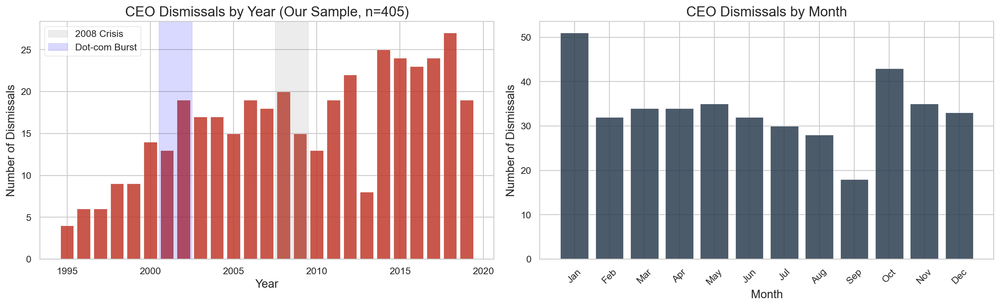
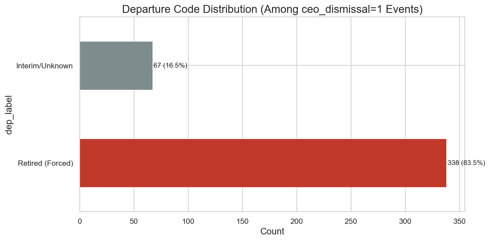
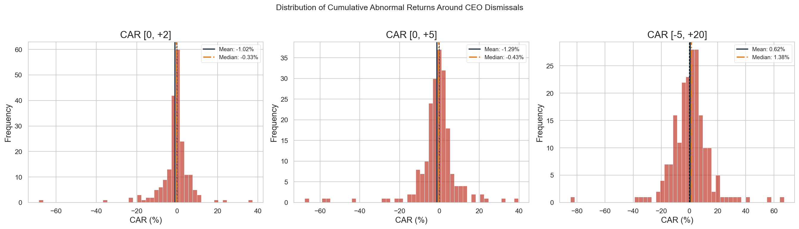
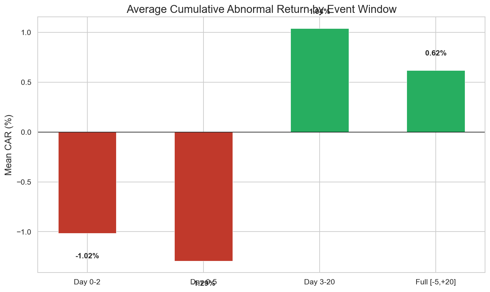
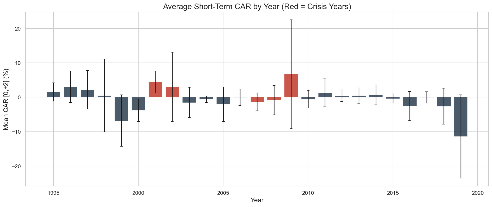
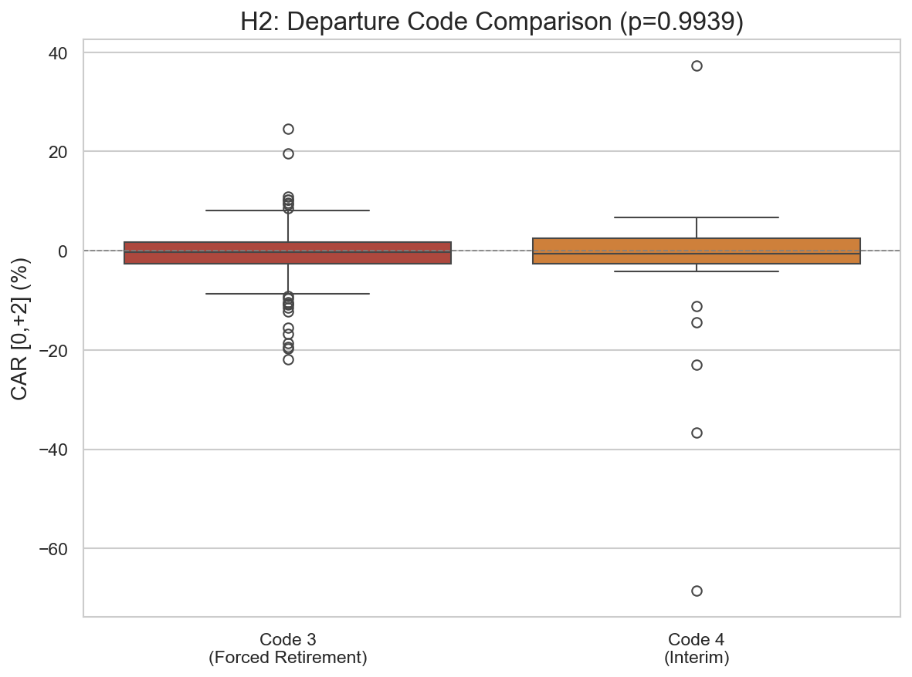
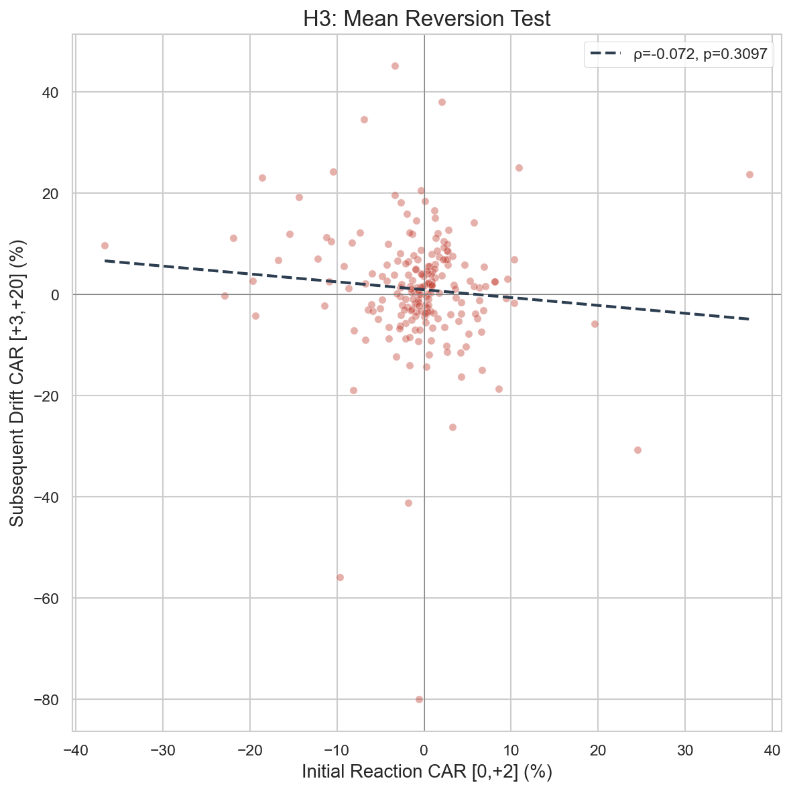
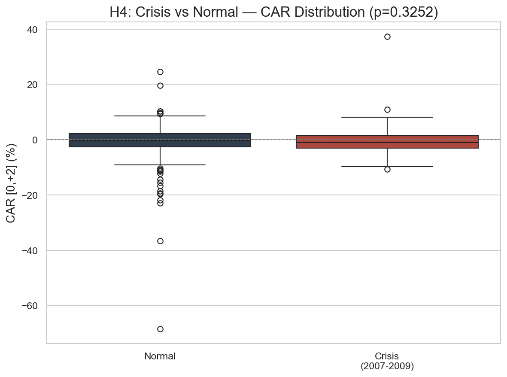
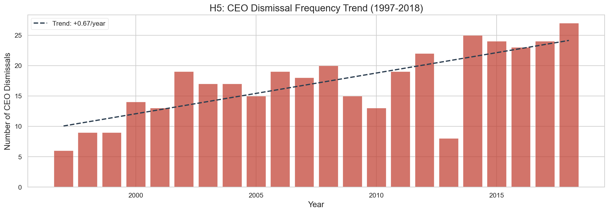

# CEO Dismissals and Stock Market Reactions: An Event Study Approach

## **DSA 210 – Introduction to Data Science (Spring 2026)**


---

## Motivation

When a CEO is forced out of a company, it sends a direct signal to the market — but does the market actually react, and if so, how? Some dismissals are welcomed by investors as a necessary course correction; others create uncertainty and drive the stock price down. Understanding this dynamic has implications both for corporate governance research and for evaluating whether a short-term trading opportunity exists around these events.

This project investigates how stock prices of S&P 1500 companies react to forced CEO departures using an **event study methodology**. By calculating Cumulative Abnormal Returns (CAR) around dismissal dates and testing whether the reaction varies by departure type, crisis periods, and historical trends, I aim to quantify the market's response to CEO turnover.

---

## Data Source

The primary dataset is the **CEO Dismissal Database** compiled by Gentry, Harrison, Quigley & Boivie (2021), published in the *Strategic Management Journal*, Vol. 42(5), pp. 968-991.

- **Source:** [Kaggle](https://www.kaggle.com/datasets/ahdvnd/database-for-ceo-dismissal-19922018) / [Zenodo (DOI: 10.5281/zenodo.4543893)](https://doi.org/10.5281/zenodo.4543893)
- **Coverage:** S&P 1500 CEO departures, 1992–2019
- **Size:** 9,390 departure records across 3,860 unique companies
- **Key variable:** `ceo_dismissal` flag (1 = forced out, 0 = voluntary)

To study stock market reactions, I enriched the dataset by:

1. Mapping company identifiers (`gvkey`) to stock tickers via manual matching and notes extraction (29.6% match rate for dismissal events)
2. Downloading daily stock prices around each dismissal event using **yfinance**
3. Calculating abnormal returns using the **market model** with S&P 500 as benchmark

| Dataset | Variable(s) | Purpose |
|---------|------------|---------|
| CEO Dismissal Database | Departure date, departure code, CEO name, ceo_dismissal flag | Identify forced CEO departures |
| Yahoo Finance (yfinance) | Daily adjusted close prices | Calculate stock returns |
| S&P 500 (^GSPC) | Daily index returns | Market benchmark for expected returns |

### Data Characteristics

- **Our analysis sample:** 405 forced dismissals with matched tickers (1995–2019)
- **After price data collection & cleaning:** ~210 events with valid CAR calculations
- **Outlier removal:** Events with |CAR| > 100% excluded as data errors (delisted/wrong ticker matches)

---

## Research Questions

### Main Question
Does the stock market exhibit a statistically significant reaction to forced CEO departures?

### Sub-Questions
1. Is the short-term abnormal return (CAR) following a CEO dismissal significantly negative?
2. Does the market reaction differ by departure type (forced retirement vs interim replacement)?
3. Is there evidence of mean reversion — do initial overreactions reverse in subsequent weeks?
4. Are dismissal reactions more severe during financial crisis periods?
5. Has the frequency of CEO dismissals increased over time?

---

## Hypotheses

| # | Hypothesis | H₀ | Test Method |
|---|-----------|-----|-------------|
| **H1** | CEO dismissal produces significant negative CAR [0,+2] | Mean CAR = 0 | One-sample t-test |
| **H2** | Market reaction differs between departure code 3 (forced retirement) and code 4 (interim) | No difference in CAR distributions | Mann-Whitney U test |
| **H3** | Initial reaction (Day 0-2) and subsequent drift (Day 3-20) are negatively correlated (mean reversion) | ρ = 0 | Spearman correlation |
| **H4** | Crisis-period (2007-2009) dismissals produce more negative CAR than normal periods | No difference | Mann-Whitney U (one-tailed) |
| **H5** | CEO dismissal frequency shows an increasing trend over 1997-2018 | No monotonic trend | Spearman correlation / Mann-Kendall |

---

## Methodology

### Event Study Design

For each CEO dismissal event:

1. **Estimation window** (Day -150 to Day -21): Estimate expected returns using the market model:  
   `R_stock = α + β × R_market`

2. **Event window** (Day -5 to Day +20): Calculate abnormal returns:  
   `AR = Actual Return - Expected Return`

3. **Cumulative Abnormal Return (CAR)**: Sum of ARs over specified windows:
   - CAR [0, +2]: Immediate short-term reaction
   - CAR [0, +5]: One-week reaction
   - CAR [3, +20]: Post-reaction drift
   - CAR [-5, +20]: Full event window

### Statistical Tests

| Test | Purpose | Applied To |
|------|---------|-----------|
| One-sample t-test | Test if mean CAR ≠ 0 | H1 |
| Mann-Whitney U | Compare two independent groups | H2, H4 |
| Spearman correlation | Test monotonic relationship | H3, H5 |

### Data Cleaning

- Removed events where |CAR| > 100% (physically impossible, indicates ticker mismatch or delisted stock)
- Applied market model only when estimation window had ≥ 50 trading days
- Event window required ≥ 5 valid trading days

---

## Exploratory Data Analysis

### Temporal Distribution

*CEO dismissals show an increasing trend over time, with concentration in January and September. Crisis periods (dot-com, 2008) are highlighted.*

### Departure Code Distribution

*83.5% of forced departures are coded as "Retired" — reflecting how companies publicly frame dismissals as voluntary retirements.*

### CAR Distributions

*CAR distributions are approximately normal with slight negative skew. Mean CAR [0,+2] = -1.02%, Median = -0.33%.*

### CAR by Event Window

*Short-term reaction is negative (-1.02% for Day 0-2, -1.29% for Day 0-5), but the subsequent drift (Day 3-20) is positive (+1.04%), suggesting partial recovery.*

### CAR by Year

*Yearly average CARs fluctuate around zero with high variance. No clear pattern distinguishes crisis years (red) from normal years.*

---

## Hypothesis Testing Results

| Hypothesis | p-value | Result | Key Insight |
|-----------|---------|--------|-------------|
| **H1:** Dismissal → Negative CAR | 0.0881 | ❌ Not significant (α=0.05) | Mean CAR = -1.02%; marginal at α=0.10 |
| **H2:** Code 3 vs Code 4 | 0.9939 | ❌ No difference | Both are forced departures — mechanism is the same |
| **H3:** Mean Reversion | 0.3097 | ❌ No relationship | ρ = -0.072; no reversion, no momentum |
| **H4:** Crisis → More negative | 0.3252 | ❌ No difference | Crisis volatility absorbs the dismissal signal |
| **H5:** Increasing trend | 0.0001 | ✅ **Confirmed** | +0.67 dismissals/year; corporate governance tightening |

**Overall: 1/5 hypotheses confirmed at α=0.05 (H1 marginal at α=0.10)**

### H2: Departure Code Comparison


### H3: Mean Reversion Test


### H4: Crisis vs Normal


### H5: Dismissal Frequency Trend


---

## Key Findings

1. **The market reacts weakly to CEO dismissals.** Mean CAR [0,+2] = -1.02% is economically meaningful but statistically marginal (p=0.088). This is consistent with semi-strong market efficiency — much of the information is already priced in before the official departure date.

2. **No difference between departure types.** Forced retirements and interim replacements generate similar market reactions, suggesting the underlying mechanism (board removes CEO) matters more than the label.

3. **No mean reversion or momentum.** The initial reaction and subsequent drift are uncorrelated (ρ=-0.072, p=0.31). This rules out a simple contrarian trading strategy based on these events.

4. **Crisis periods do not amplify the reaction.** During 2007-2009, the CEO dismissal signal is lost in overall market noise, producing no significantly different CAR compared to normal periods.

5. **CEO dismissals are becoming more frequent.** A strong upward trend (+0.67/year, p=0.0001) over 1997-2018 reflects increasing corporate governance pressure and board activism.

---

## Limitations and Future Work

### Limitations
- **Ticker matching coverage:** Only 29.6% of dismissal events could be matched to stock tickers via manual mapping, introducing potential large-company bias
- **Event date precision:** The `leftofc` date may not be the exact announcement date — news leaks could cause the market to react days earlier
- **No confounding event control:** Simultaneous earnings announcements, M&A news, or sector-wide events are not filtered out
- **Single-factor market model:** Does not capture industry-specific or size-related risk factors

### Future Improvements
- Obtain complete gvkey→ticker mapping via WRDS/Compustat for full sample coverage
- Use 8-K SEC filing dates as the precise event date (available in newer Zenodo versions)
- Apply Fama-French 3-factor or 4-factor model for more robust expected returns
- Incorporate firm characteristics (market cap, sector, prior performance) as control variables
- Extend to the 2020-2022 updated dataset available on Zenodo
- Explore machine learning models (Random Forest, XGBoost) for predicting CAR direction

---

## Project Structure

```
CEO-Dismissal-EventStudy/
├── data/
│   ├── dismissal_events_with_tickers.csv   # 405 events with matched tickers
│   └── car_results.csv                     # Calculated CAR values
├── figures/                                # All generated plots
│   ├── eda_temporal_distribution.png
│   ├── eda_departure_codes.png
│   ├── car_distributions.png
│   ├── car_by_window.png
│   ├── car_by_year.png
│   ├── h2_departure_comparison.png
│   ├── h3_mean_reversion.png
│   ├── h4_crisis_comparison.png
│   └── h5_dismissal_trend.png
├── ceo_dismissal_analysis.py               # Main analysis script (EDA + Hypothesis Testing)
├── Project_Proposal.pdf                    # Project proposal document
├── requirements.txt
└── README.md
```

---

## Setup and Reproducibility

### Requirements
- Python 3.9+
- Dependencies listed in `requirements.txt`

### Installation
```bash
git clone https://github.com/aliakgun-bit/CEO-Dismissal-EventStudy.git
cd CEO-Dismissal-EventStudy
pip install -r requirements.txt
```

### Running the Analysis

**Step 1:** If you need to re-fetch stock prices (takes ~25 min):
```bash
python ceo_dismissal_analysis_v1.py
```
This generates `data/car_results.csv`.

**Step 2:** Run cleaned analysis + hypothesis tests:
```bash
python ceo_dismissal_analysis_v2.py
```
This reads `data/car_results.csv`, cleans outliers, runs all EDA and hypothesis tests, and saves figures.

---

## References

- Gentry, R. J., Harrison, J. S., Quigley, T. J., & Boivie, S. (2021). A database of CEO turnover and dismissal in S&P 1500 firms, 2000–2018. *Strategic Management Journal*, 42(5), 968-991. DOI: [10.1002/smj.3278](https://doi.org/10.1002/smj.3278)
- MacKinlay, A. C. (1997). Event studies in economics and finance. *Journal of Economic Literature*, 35(1), 13-39.

---

## AI Assistance Disclosure

AI tools (Claude) were used for:
- Data cleaning and ticker matching automation
- Debugging Python code
- Statistical test selection and interpretation
- README structure and documentation

All hypothesis formulation, data source selection, methodology decisions, and interpretation of results were performed independently.
